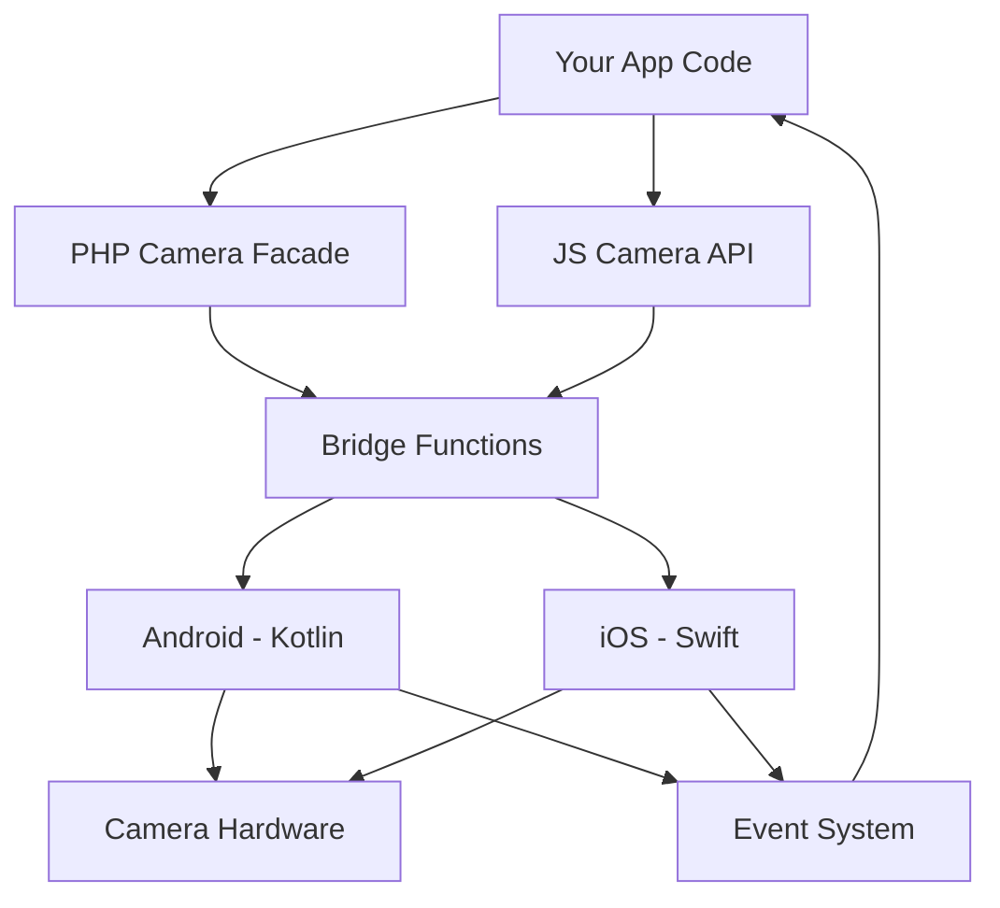

The Camera plugin uses a bridge architecture to connect your PHP or JavaScript code with native mobile camera functionality on Android and iOS.

## Overview

The plugin consists of three main layers:

1. **API Layer** - PHP facades and JavaScript functions that developers use
2. **Bridge Layer** - Communication channel between web and native code
3. **Native Layer** - Platform-specific implementations in Kotlin (Android) and Swift (iOS)



## Bridge Functions

The plugin registers three bridge functions defined in `nativephp.json`:

<AccordionGroup>
  <Accordion title="Camera.GetPhoto">
    **Android**: `com.nativephp.camera.CameraFunctions.GetPhoto`
    
    **iOS**: `CameraFunctions.GetPhoto`
    
    Launches the device camera to capture a photo. Returns results via the `PhotoTaken` event.
  </Accordion>

  <Accordion title="Camera.RecordVideo">
    **Android**: `com.nativephp.camera.CameraFunctions.RecordVideo`
    
    **iOS**: `CameraFunctions.RecordVideo`
    
    Launches the device camera to record a video with optional duration limits. Returns results via the `VideoRecorded` event.
  </Accordion>

  <Accordion title="Camera.PickMedia">
    **Android**: `com.nativephp.camera.GalleryFunctions.PickMedia`
    
    **iOS**: `CameraFunctions.PickMedia`
    
    Opens the device gallery picker for selecting photos or videos. Returns results via the `MediaSelected` event.
  </Accordion>
</AccordionGroup>

## API Layers

### PHP API

The PHP API provides a clean, fluent interface:

```php
use Native\Mobile\Facades\Camera;

// Simple usage
Camera::getPhoto();

// Fluent API
Camera::recordVideo()
    ->maxDuration(60)
    ->id('my-video')
    ->start();
```

The `Camera` facade is registered by the `CameraServiceProvider` class.

### JavaScript API

The JavaScript API mirrors the PHP API for consistency:

```javascript
import { Camera } from '#nativephp';

// Simple usage
await Camera.getPhoto();

// Fluent API
await Camera.recordVideo()
    .maxDuration(60)
    .id('my-video');
```

## Native Implementations

### Android (Kotlin)

The Android implementation uses:
- **CameraFunctions.kt** - Main bridge function implementations
- **CameraCoordinator.kt** - Manages camera lifecycle and permissions
- **GalleryFunctions.kt** - Gallery picker implementation
- **CameraForegroundService.kt** - Background service for video recording

Key Android APIs used:
- `UIImagePickerController` for camera access
- Fragment-based architecture for lifecycle management
- Foreground service for uninterrupted video recording

### iOS (Swift)

The iOS implementation uses:
- **CameraFunctions.swift** - All bridge functions and delegates
- **AVFoundation** - Camera and microphone access
- **PhotosUI** - Modern photo picker (PHPickerViewController)
- **UIImagePickerController** - Camera capture interface

Key iOS classes:
- `CameraPhotoDelegate` - Handles photo capture results
- `CameraVideoDelegate` - Handles video recording results
- `CameraGalleryManager` - Manages gallery selection

## Event Flow

All camera operations are asynchronous and return results via events:

<Steps>
  <Step title="User triggers camera action">
    Your app calls `Camera::getPhoto()`, `Camera::recordVideo()`, or `Camera::pickImages()`
  </Step>
  
  <Step title="Bridge function executes">
    The bridge layer routes the call to the appropriate native implementation
  </Step>
  
  <Step title="Native UI appears">
    Android or iOS displays the camera interface or gallery picker
  </Step>
  
  <Step title="User completes action">
    User captures photo/video or selects media (or cancels)
  </Step>
  
  <Step title="Event fired">
    Native code fires an event (e.g., `PhotoTaken`, `VideoRecorded`) back to your app
  </Step>
  
  <Step title="Your event handler runs">
    Your PHP or JavaScript event handler receives the file path and processes it
  </Step>
</Steps>

<Note>
  Bridge functions return immediately (empty response). Results are always delivered via events.
</Note>

## Namespace

All bridge functions are registered under the `Camera` namespace, as defined in `nativephp.json`:

```json
{
  "namespace": "Camera",
  "bridge_functions": [
    // ...
  ]
}
```

This allows NativePHP to properly route calls from your code to the native implementations.

## Next Steps

<CardGroup cols={2}>
  <Card title="Permissions" icon="shield-check" href="/concepts/permissions">
    Learn how to configure camera and microphone permissions
  </Card>
  <Card title="Events" icon="bolt" href="/concepts/events">
    Understand the event-driven architecture
  </Card>
</CardGroup>
