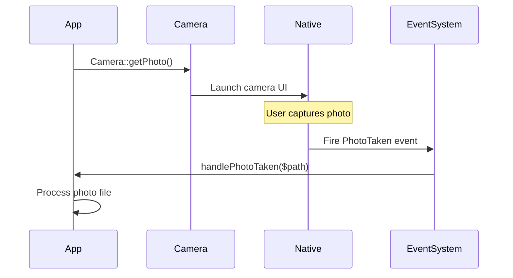

The Camera plugin uses an event-driven architecture. All camera operations are asynchronous and return results through events rather than direct return values.

## Why Events?

Camera operations involve native UI interactions that can't return immediate results:

- User must interact with camera UI
- User can cancel at any time
- Permissions may be denied
- File processing happens asynchronously

Events allow your app to respond to these outcomes without blocking execution.

## Event Flow



## Available Events

The plugin fires six different events defined in `nativephp.json`:

### Photo Events
- `Native\Mobile\Events\Camera\PhotoTaken`
- `Native\Mobile\Events\Camera\PhotoCancelled`

### Video Events
- `Native\Mobile\Events\Camera\VideoRecorded`
- `Native\Mobile\Events\Camera\VideoCancelled`

### Gallery Events
- `Native\Mobile\Events\Gallery\MediaSelected`

### Permission Events
- `Native\Mobile\Events\Camera\PermissionDenied`

## Listening to Events

### In PHP

Use the `#[OnNative]` attribute to listen for events:

```php
use Native\Mobile\Attributes\OnNative;
use Native\Mobile\Events\Camera\PhotoTaken;

class MyComponent extends Component
{
    #[OnNative(PhotoTaken::class)]
    public function handlePhotoTaken(string $path)
    {
        // $path is the file path to the captured photo
        $this->processPhoto($path);
    }
}
```

### In JavaScript

Use the `On()` and `Off()` functions to manage event listeners:

<Tabs>
  <Tab title="Vue">
    ```javascript
    import { On, Off, Events } from '#nativephp';
    import { ref, onMounted, onUnmounted } from 'vue';

    const photoPath = ref('');

    const handlePhotoTaken = (payload) => {
        photoPath.value = payload.path;
        processPhoto(payload.path);
    };

    onMounted(() => {
        On(Events.Camera.PhotoTaken, handlePhotoTaken);
    });

    onUnmounted(() => {
        Off(Events.Camera.PhotoTaken, handlePhotoTaken);
    });
    ```
  </Tab>
  <Tab title="React">
    ```javascript
    import { On, Off, Events } from '#nativephp';
    import { useEffect, useState } from 'react';

    function MyComponent() {
        const [photoPath, setPhotoPath] = useState('');

        useEffect(() => {
            const handlePhotoTaken = (payload) => {
                setPhotoPath(payload.path);
                processPhoto(payload.path);
            };

            On(Events.Camera.PhotoTaken, handlePhotoTaken);
            
            return () => {
                Off(Events.Camera.PhotoTaken, handlePhotoTaken);
            };
        }, []);

        // ...
    }
    ```
  </Tab>
</Tabs>

<Warning>
  Always clean up event listeners in JavaScript using `Off()` to prevent memory leaks.
</Warning>

## Event Payloads

Each event carries different data:

### Success Events

<Tabs>
  <Tab title="PhotoTaken">
    ```typescript
    {
        path: string,      // File path to captured photo
        mimeType: string,  // "image/jpeg"
        id?: string        // Optional identifier if provided
    }
    ```
  </Tab>
  <Tab title="VideoRecorded">
    ```typescript
    {
        path: string,      // File path to recorded video
        mimeType: string,  // "video/mp4" (or other format)
        id?: string        // Optional identifier if provided
    }
    ```
  </Tab>
  <Tab title="MediaSelected">
    ```typescript
    {
        success: boolean,  // true
        files: Array<{     // Array of selected files
            path: string,
            mimeType: string,
            extension: string,
            type: string   // "image" or "video"
        }>,
        count: number,     // Number of files selected
        id?: string        // Optional identifier if provided
    }
    ```
  </Tab>
</Tabs>

### Cancel Events

<Tabs>
  <Tab title="PhotoCancelled">
    ```typescript
    {
        cancelled: true,
        id?: string
    }
    ```
  </Tab>
  <Tab title="VideoCancelled">
    ```typescript
    {
        cancelled: true,
        id?: string
    }
    ```
  </Tab>
  <Tab title="MediaSelected (cancelled)">
    ```typescript
    {
        success: false,
        files: [],
        count: 0,
        cancelled: true,
        id?: string
    }
    ```
  </Tab>
</Tabs>

### Permission Denied Event

```typescript
{
    action: "photo" | "video" | "gallery",
    id?: string
}
```

## Custom Event Classes

You can specify custom event classes instead of the defaults:

<Tabs>
  <Tab title="PHP">
    ```php
    use Native\Mobile\Facades\Camera;

    Camera::getPhoto()
        ->event('App\\Events\\ProfilePhotoTaken')
        ->id('profile-pic');
    ```
  </Tab>
  <Tab title="JavaScript">
    ```javascript
    await Camera.getPhoto()
        .event('App\\Events\\ProfilePhotoTaken')
        .id('profile-pic');
    ```
  </Tab>
</Tabs>

<Note>
  Custom events must be properly namespaced Laravel event classes on the PHP side.
</Note>

## Tracking with IDs

Use the `id()` method to track specific operations:

```php
// Initiate capture with ID
Camera::getPhoto()->id('profile-pic');

// Handle with ID
#[OnNative(PhotoTaken::class)]
public function handlePhotoTaken(string $path, ?string $id = null)
{
    if ($id === 'profile-pic') {
        $this->updateProfilePicture($path);
    } else {
        $this->addToGallery($path);
    }
}
```

This is especially useful when you have multiple camera operations in the same component.

## Error Handling

Always handle potential failures:

```php
#[OnNative(PhotoTaken::class)]
public function handlePhotoTaken(string $path)
{
    try {
        if (!file_exists($path)) {
            throw new \Exception('Photo file not found');
        }
        
        $this->processPhoto($path);
    } catch (\Exception $e) {
        Log::error('Photo processing failed: ' . $e->getMessage());
        $this->dispatch('notify', ['error' => 'Failed to process photo']);
    }
}

#[OnNative(PhotoCancelled::class)]
public function handlePhotoCancelled()
{
    // User cancelled - no action needed, or show message
    $this->dispatch('notify', ['info' => 'Photo capture cancelled']);
}

#[OnNative(PermissionDenied::class)]
public function handlePermissionDenied(string $action)
{
    $this->dispatch('notify', [
        'error' => 'Camera permission required',
        'action' => 'Open Settings'
    ]);
}
```

## Best Practices

<Steps>
  <Step title="Always handle cancellation">
    Users can cancel camera operations. Always listen for cancel events and handle them gracefully.
  </Step>
  
  <Step title="Clean up event listeners">
    In JavaScript, always use `Off()` in cleanup functions to prevent memory leaks.
  </Step>
  
  <Step title="Use IDs for tracking">
    When you have multiple camera operations, use the `id()` method to identify which operation completed.
  </Step>
  
  <Step title="Handle permission denial">
    Listen for `PermissionDenied` events and guide users to grant permissions in system settings.
  </Step>
  
  <Step title="Validate file existence">
    Always verify the file exists before processing, especially on mobile where files may be in temporary storage.
  </Step>
</Steps>

## Next Steps

<CardGroup cols={2}>
  <Card title="Event Reference" icon="book" href="/events/overview">
    Detailed documentation for each event
  </Card>
  <Card title="Storage" icon="database" href="/concepts/storage">
    Learn where captured files are stored
  </Card>
</CardGroup>
