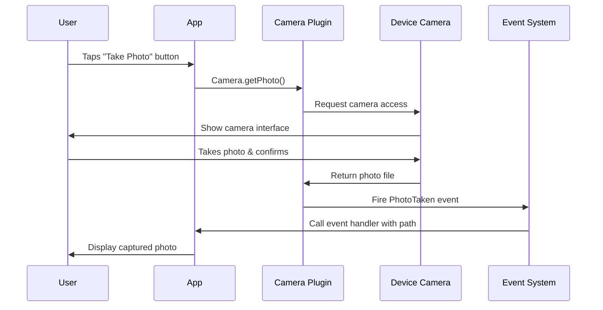

This guide will walk you through creating a simple photo capture feature. You'll learn how to trigger the camera, handle the captured photo, and display it to users.

## What you'll build

By the end of this tutorial, you'll have:
- A button that opens the device camera
- An event handler that receives the captured photo
- Display of the captured image in your UI

<Note>
  This quickstart assumes you've already [installed the Camera plugin](/installation). If not, complete the installation first.
</Note>

## Choose your stack

The Camera plugin supports both PHP and JavaScript APIs. Choose the approach that matches your frontend:

<Tabs>
  <Tab title="PHP (Livewire)">
    Best for Laravel Livewire applications using Blade templates.
  </Tab>
  <Tab title="JavaScript (Vue/React)">
    Best for Vue, React, or Inertia.js applications with JavaScript frontends.
  </Tab>
</Tabs>

## Capture a photo

<Steps>
  <Step title="Import the Camera facade">
    In your Livewire component or controller, import the Camera facade:

    <CodeGroup>

    ```php Livewire Component
    <?php

    namespace App\Livewire;

    use Livewire\Component;
    use Native\Mobile\Facades\Camera;
    use Native\Mobile\Attributes\OnNative;
    use Native\Mobile\Events\Camera\PhotoTaken;

    class CapturePhoto extends Component
    {
        public $photoPath = null;
        public $status = 'No photo captured yet';

        // Methods will go here

        public function render()
        {
            return view('livewire.capture-photo');
        }
    }
    ```

    ```javascript Vue Component
    <script setup>
    import { ref, onMounted, onUnmounted } from 'vue';
    import { Camera, On, Off, Events } from '#nativephp';

    const photoPath = ref('');
    const status = ref('No photo captured yet');

    // Functions will go here
    </script>
    ```

    </CodeGroup>
  </Step>

  <Step title="Add a capture method">
    Create a method that triggers the camera:

    <CodeGroup>

    ```php Livewire Component
    public function capturePhoto()
    {
        $this->status = 'Opening camera...';
        Camera::getPhoto();
    }
    ```

    ```javascript Vue Component
    const capturePhoto = async () => {
      status.value = 'Opening camera...';
      await Camera.getPhoto();
    };
    ```

    </CodeGroup>

    <Note>
      `getPhoto()` opens the device camera immediately. The method returns right away, and you'll receive the photo via an event.
    </Note>
  </Step>

  <Step title="Handle the PhotoTaken event">
    Add an event handler to receive the captured photo:

    <CodeGroup>

    ```php Livewire Component
    #[OnNative(PhotoTaken::class)]
    public function handlePhotoTaken(string $path)
    {
        $this->photoPath = $path;
        $this->status = 'Photo captured successfully!';
        
        // Optional: Process the photo
        // $this->uploadToServer($path);
        // $this->createThumbnail($path);
    }
    ```

    ```javascript Vue Component
    const handlePhotoTaken = (payload) => {
      photoPath.value = payload.path;
      status.value = 'Photo captured successfully!';
      
      // Optional: Process the photo
      // uploadToServer(payload.path);
      // createThumbnail(payload.path);
    };

    onMounted(() => {
      On(Events.Camera.PhotoTaken, handlePhotoTaken);
    });

    onUnmounted(() => {
      Off(Events.Camera.PhotoTaken, handlePhotoTaken);
    });
    ```

    </CodeGroup>

    <Warning>
      For JavaScript, always unregister event listeners in `onUnmounted` to prevent memory leaks.
    </Warning>
  </Step>

  <Step title="Create the UI">
    Add a button to trigger the camera and display the captured photo:

    <CodeGroup>

    ```blade Livewire View
    <div>
        <div class="mb-4">
            <button 
                wire:click="capturePhoto"
                class="px-4 py-2 bg-blue-500 text-white rounded hover:bg-blue-600"
            >
                Take Photo
            </button>
        </div>

        <div class="text-sm text-gray-600 mb-4">
            {{ $status }}
        </div>

        @if($photoPath)
            <div class="border rounded p-4">
                
            </div>
        @endif
    </div>
    ```

    ```vue Vue Template
    <template>
      <div>
        <div class="mb-4">
          <button 
            @click="capturePhoto"
            class="px-4 py-2 bg-blue-500 text-white rounded hover:bg-blue-600"
          >
            Take Photo
          </button>
        </div>

        <div class="text-sm text-gray-600 mb-4">
          {{ status }}
        </div>

        <div v-if="photoPath" class="border rounded p-4">
          
        </div>
      </div>
    </template>
    ```

    </CodeGroup>
  </Step>
</Steps>

## Test your implementation

<Steps>
  <Step title="Build and run your app">
    Compile your NativePHP mobile app:

    ```bash
    php artisan native:build android
    # or
    php artisan native:build ios
    ```
  </Step>

  <Step title="Grant camera permissions">
    When you first tap "Take Photo", the app will request camera permission. Tap "Allow" to grant access.

    <Note>
      If you deny permission, the camera won't open. You can reset permissions in your device settings.
    </Note>
  </Step>

  <Step title="Capture a photo">
    The native camera interface will open. Take a photo and tap the confirmation button (checkmark or "Use Photo" depending on platform).
  </Step>

  <Step title="See the result">
    The photo should appear in your UI, and the status should update to "Photo captured successfully!".
  </Step>
</Steps>

## Understanding the flow

Here's what happens when a user captures a photo:



## Add an identifier

When capturing multiple photos in different contexts (profile picture, document scan, etc.), use identifiers to track which photo is which:

<CodeGroup>

```php PHP
public function captureProfilePhoto()
{
    Camera::getPhoto()->id('profile-picture')->start();
}

public function captureDocumentScan()
{
    Camera::getPhoto()->id('document-scan')->start();
}

#[OnNative(PhotoTaken::class)]
public function handlePhotoTaken(string $path, ?string $id = null)
{
    match($id) {
        'profile-picture' => $this->updateProfile($path),
        'document-scan' => $this->processDocument($path),
        default => $this->savePhoto($path),
    };
}
```

```javascript JavaScript
const captureProfilePhoto = async () => {
  await Camera.getPhoto().id('profile-picture');
};

const captureDocumentScan = async () => {
  await Camera.getPhoto().id('document-scan');
};

const handlePhotoTaken = (payload) => {
  switch(payload.id) {
    case 'profile-picture':
      updateProfile(payload.path);
      break;
    case 'document-scan':
      processDocument(payload.path);
      break;
    default:
      savePhoto(payload.path);
  }
};
```

</CodeGroup>

## Next steps

<CardGroup cols={2}>
  <Card
    title="Record videos"
    icon="video"
    href="/api/video-recording"
  >
    Learn how to record videos with duration limits
  </Card>
  <Card
    title="Gallery picker"
    icon="images"
    href="/api/gallery-picker"
  >
    Select existing photos from the device gallery
  </Card>
  <Card
    title="Event reference"
    icon="bell"
    href="/events/overview"
  >
    Explore all camera events and their payloads
  </Card>
  <Card
    title="Storage locations"
    icon="folder"
    href="/concepts/storage"
  >
    Understand where photos and videos are stored
  </Card>
</CardGroup>

## Troubleshooting

### Camera doesn't open

**Cause:** Camera permission was denied or not configured.

**Solution:** 
1. Check that camera permissions are in your `config/nativephp.php`
2. Uninstall and reinstall the app to reset permissions
3. Grant permission when prompted

### Photo event not firing

**Cause:** Event listener not properly registered.

**Solution:**
- **PHP:** Ensure you're using the `#[OnNative(PhotoTaken::class)]` attribute
- **JavaScript:** Verify you called `On(Events.Camera.PhotoTaken, handler)` in `onMounted`

### Photo path is invalid

**Cause:** File was moved or deleted before processing.

**Solution:** Process the photo immediately in your event handler, or copy it to permanent storage:

```php
#[OnNative(PhotoTaken::class)]
public function handlePhotoTaken(string $path)
{
    // Copy to permanent storage
    $newPath = Storage::putFile('photos', new File($path));
    $this->photoPath = Storage::url($newPath);
}
```
